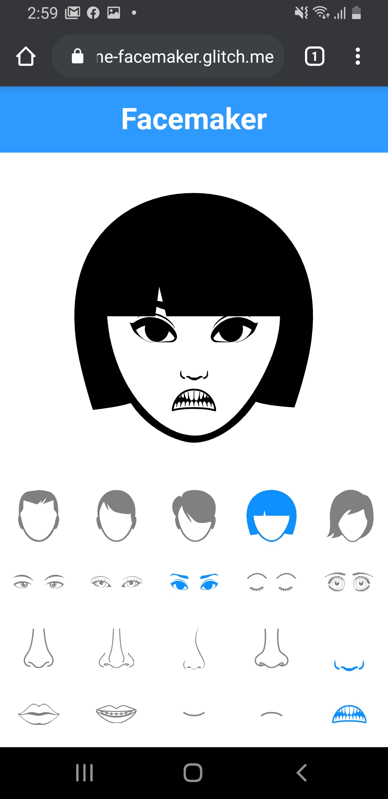

## Face Maker Web Application
## Course: IT2310 - Web Programming
## Student: [Abdul Irfan Rafay]

# Technologies Used
- HTML
- CSS
- JavaScript
- jQuery

# Application Features
- Users can select facial features from a list of options
- Selected features are displayed on a face template in real-time
- Users can save and download their created face as an image file

# Suggestion: Add feature to load saved faces

# Load Saved Faces
- Add a button or link for users to load previously saved faces
- Use jQuery to send a GET request to a server-side script that retrieves saved faces from a database
- Display loaded faces as selectable options, allowing users to choose which face to load
- Once a face is loaded, update the face template with the loaded facial features

# Facemaker

## Setup

1. You need to have [Python](https://realpython.com/installing-python/) installed on your computer
2. Run the following commands in the Terminal:
python -m http.server 8080
3. Open your web browser and navigate to http://localhost:8080

## Setup 2
1. Install live server extension in vs code editor
2. Open Index.html file
3. At bottom pane in vs code editor, click on Go live

## Setup 3
# Download the Files:
index.html
main.css
main.js
The images/ folder containing PNG images for different facial features.
# Organize Files:
Ensure that all files are saved in the same directory or folder on your computer.

# Open index.html:
Double-click on the index.html file to open it in your preferred web browser. This will display the Face Maker web application in your browser window.

# Interact with the Application:
Once the web page loads, you can interact with the Face Maker application by:

1. Clicking on the buttons to select different options for head shape, eyes, nose, and mouth.
2. Observing how the selected facial features are dynamically displayed on the face area of the web page.
3. Customize and Generate Faces: Experiment with different combinations of facial features to create customized faces.

# Enjoy and Explore:
Have fun exploring the functionality of the Face Maker application and generating various faces!